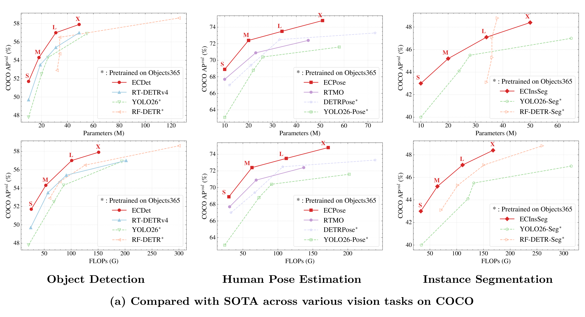

<h1 align="center">EdgeCrafter: Compact ViTs for Edge Dense Prediction via
Task-Specialized Distillation</h1>

<p align="center">
  <a href="https://intellindust-ai-lab.github.io/projects/EdgeCrafter/"></a>
  <a href="https://arxiv.org/abs/2603.18739"></a>
  <a href="#"></a>

</p>

<p align="center">
        <a href="https://capsule2077.github.io/">Longfei Liu <sup>*</sup><sup>‡</sup></a>&nbsp;
        <a >Yongjie Hou <sup>*</sup></a>&nbsp;
        <a >Yang Li <sup>*</sup></a>&nbsp;
        <a href='https://qiruiwang0728.github.io/homepage/'>Qirui Wang <sup>*</sup></a>&nbsp;
        <a >Youyang Sha</a>&nbsp; </br>
        <a >Yongjun Yu</a>&nbsp;
        <a >Yinzhi Wang</a>&nbsp;
        <a >Peizhe Ru</a>&nbsp;
        <a href="https://xuanlong-yu.github.io/">Xuanlong Yu<sup>†</sup></a>&nbsp
        <a href="https://xishen0220.github.io/">Xi Shen <sup>†</sup></a> <br><br>
      <a> * Equal Contribution &nbsp;&nbsp; ‡ Project Leader &nbsp;&nbsp; † Corresponding Author</a> <br>
</p>

<p align="center">
    <sup></sup> <a href="https://intellindust-ai-lab.github.io">Intellindust AI Lab</a> <br> 
</p>

<p align="center" style="margin:0; padding:0;">
  
</p>


---

## 🚀 Updates

- **[2026-03-19]** Initial release of EdgeCrafter.

---
## 📍 Reproducing the Results

- **Detection & Segmentation:** [Instructions](./ecdetseg)
- **Pose Estimation:** [Instructions](./ecpose)

---

## 🏆 Model Zoo

### COCO2017 Validation Results

> **Note**: Latency is measured on an NVIDIA T4 GPU with batch size 1 under FP16 precision using TensorRT (v10.6).

### Object Detection

| Model | Size | AP<sub>50:95</sub> | #Params | GFLOPs | Latency (ms) | Config | Log | Checkpoint |
|:-----:|:----:|:--:|:-------:|:------:|:------------:|:------:|:---:|:----------:|
| **ECDet-S** | 640 | 51.7 | 10 | 26 | 5.41 | [config](ecdetseg/configs/ecdet/ecdet_s.yml) | [log](https://github.com/capsule2077/edgecrafter/raw/refs/heads/main/logs/ecdet_s.log) | [model](https://github.com/capsule2077/edgecrafter/releases/download/edgecrafterv1/ecdet_s.pth) |
| **ECDet-M** | 640 | 54.3 | 18 | 53 | 7.98 | [config](ecdetseg/configs/ecdet/ecdet_m.yml) | [log](https://github.com/capsule2077/edgecrafter/raw/refs/heads/main/logs/ecdet_m.log) | [model](https://github.com/capsule2077/edgecrafter/releases/download/edgecrafterv1/ecdet_m.pth) |
| **ECDet-L** | 640 | 57.0 | 31 | 101 | 10.49 | [config](ecdetseg/configs/ecdet/ecdet_l.yml) | [log](https://github.com/capsule2077/edgecrafter/raw/refs/heads/main/logs/ecdet_l.log) | [model](https://github.com/capsule2077/edgecrafter/releases/download/edgecrafterv1/ecdet_l.pth) |
| **ECDet-X** | 640 | 57.9 | 49 | 151 | 12.70 | [config](ecdetseg/configs/ecdet/ecdet_x.yml) | [log](https://github.com/capsule2077/edgecrafter/raw/refs/heads/main/logs/ecdet_x.log) | [model](https://github.com/capsule2077/edgecrafter/releases/download/edgecrafterv1/ecdet_x.pth) |

### Instance Segmentation

| Model | Size | AP<sub>50:95</sub> | #Params | GFLOPs | Latency (ms) | Config | Log | Checkpoint |
|:-----:|:----:|:--:|:-------:|:------:|:------------:|:------:|:---:|:----------:|
| **ECSeg-S** | 640 | 43.0 | 10 | 33 | 6.96 | [config](ecdetseg/configs/ecseg/ecseg_s.yml) | [log](https://github.com/capsule2077/edgecrafter/raw/refs/heads/main/logs/ecseg_s.log) | [model](https://github.com/capsule2077/edgecrafter/releases/download/edgecrafterv1/ecseg_s.pth) |
| **ECSeg-M** | 640 | 45.2 | 20 | 64 | 9.85 | [config](ecdetseg/configs/ecseg/ecseg_m.yml) | [log](https://github.com/capsule2077/edgecrafter/raw/refs/heads/main/logs/ecseg_m.log) | [model](https://github.com/capsule2077/edgecrafter/releases/download/edgecrafterv1/ecseg_m.pth) |
| **ECSeg-L** | 640 | 47.1 | 34 | 111 | 12.56 | [config](ecdetseg/configs/ecseg/ecseg_l.yml) | [log](https://github.com/capsule2077/edgecrafter/raw/refs/heads/main/logs/ecseg_l.log) | [model](https://github.com/capsule2077/edgecrafter/releases/download/edgecrafterv1/ecseg_l.pth) |
| **ECSeg-X** | 640 | 48.4 | 50 | 168 | 14.96 | [config](ecdetseg/configs/ecseg/ecseg_x.yml) | [log](https://github.com/capsule2077/edgecrafter/raw/refs/heads/main/logs/ecseg_x.log) | [model](https://github.com/capsule2077/edgecrafter/releases/download/edgecrafterv1/ecseg_x.pth) |

### Pose Estimation

| Model | Size | AP<sub>50:95</sub> | #Params | GFLOPs | Latency (ms) | Config | Log | Checkpoint |
|:-----:|:----:|:--:|:-------:|:------:|:------------:|:------:|:---:|:----------:|
| **ECPose-S** | 640 | 68.9 |  10 | 30 | 5.54 | [config](ecpose/configs/ecpose/ecpose_s_coco.yml) | [log](https://github.com/capsule2077/edgecrafter/raw/refs/heads/main/logs/ecpose_s.log) | [model](https://github.com/capsule2077/edgecrafter/releases/download/edgecrafterv1/ecpose_s.pth) |
| **ECPose-M** | 640 | 72.4 |  20 | 63 | 9.25 | [config](ecpose/configs/ecpose/ecpose_m_coco.yml) | [log](https://github.com/capsule2077/edgecrafter/raw/refs/heads/main/logs/ecpose_m.log) | [model](https://github.com/capsule2077/edgecrafter/releases/download/edgecrafterv1/ecpose_m.pth) |
| **ECPose-L** | 640 | 73.5 |  34 | 112 | 11.83 | [config](ecpose/configs/ecpose/ecpose_l_coco.yml) | [log](https://github.com/capsule2077/edgecrafter/raw/refs/heads/main/logs/ecpose_l.log) | [model](https://github.com/capsule2077/edgecrafter/releases/download/edgecrafterv1/ecpose_l.pth) |
| **ECPose-X** | 640 | 74.8 |  51 | 172 | 14.31 | [config](ecpose/configs/ecpose/ecpose_x_coco.yml) | [log](https://github.com/capsule2077/edgecrafter/raw/refs/heads/main/logs/ecpose_x.log) | [model](https://github.com/capsule2077/edgecrafter/releases/download/edgecrafterv1/ecpose_x.pth) |
---

## 📦 Installation

```bash
# Clone the repository
git clone https://github.com/your-org/edgecrafter.git
cd edgecrafter

# Create conda environment
conda create -n ec python=3.11 -y
conda activate ec

# Install dependencies
pip install -r requirements.txt
```

### ⚡ Quick Start (Inference)
The easiest way to test EdgeCrafter is to run inference on a sample image using a pre-trained model.
```bash
# 1. Download a pre-trained model (e.g., ECDet-L)
cd ecdetseg
wget https://github.com/capsule2077/edgecrafter/releases/download/edgecrafterv1/ecdet_l.pth
# 2. Run PyTorch inference
# Make sure to replace `path/to/your/image.jpg` with an actual image path
python tools/inference/torch_inf.py -c configs/ecdet/ecdet_l.yml -r ecdet_l.pth -i path/to/your/image.jpg
```


## 📄 License

This project is released under the [Apache 2.0 License](./LICENSE).

---

## 🙏 Acknowledgements

We thank the authors of the following open-source projects that made this work possible: [RT-DETR](https://github.com/lyuwenyu/RT-DETR), [D-FINE](https://github.com/Peterande/D-FINE), [DEIM](https://github.com/Intellindust-AI-Lab/DEIM), [lightly-train](https://github.com/lightly-ai/lightly-train), [DETRPose](https://github.com/SebastianJanampa/DETRPose), [RF-DETR](https://github.com/roboflow/rf-detr), [DINOv3](https://github.com/facebookresearch/dinov3)

--- 

## 📚 Citation

If you find this project useful in your research, please consider citing:

```bibtex
@article{liu2026edgecrafter,
  title={EdgeCrafter: Compact ViTs for Edge Dense Prediction via Task-Specialized Distillation},
  author={Liu, Longfei and Hou, Yongjie and Li, Yang and Wang, Qirui and Sha, Youyang and Yu, Yongjun and Wang, Yinzhi and Ru, Peizhe and Yu, Xuanlong and Shen, Xi},
  journal={arXiv},
  year={2026}
}
```
